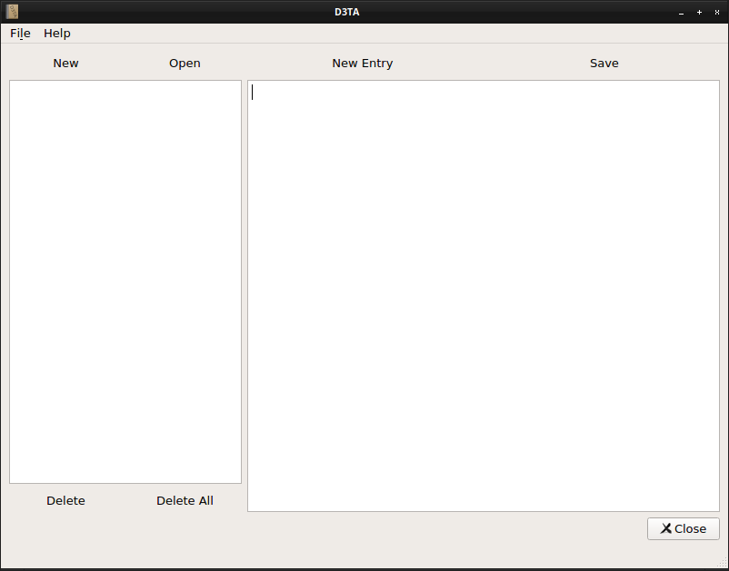

# D3TA (Dear Diary, Don't Tell Anyone)

### An encrypted diary program

Store your diary entries encrypted with this program.<br>

Requirements:
+ Python 3.6 or newer
+ bcrypt
+ pycrypto
+ urwid 2.x
+ pyqt5

The program stores the data in a SQLite3 database file. It may have any name and extension you provide, although I'd recommend using the .sqlite3 extension.
The GUI actually saves each new file with it.

Each entry is stored in a table with three values, one date, one hint and one text with types of datetime, tinytext and longtext, respectively.
The date is the date and time when the entry was created and the hint is an optional user input.
The program shows the name of an entry as the combination of the datetime and the hint.

The database itself is not password protected, but each text entry is encrypted with [PyCrypto](https://www.dlitz.net/software/pycrypto/) using the AES algorithm and hashed with SHA-256 for storage.

A salted hash generated from the password using [bcrypt](https://github.com/pyca/bcrypt/) is also stored in the database, in another table.

The program allows you to create new databases, change their passwords, create new entries, save and modify entries, delete entries and empty databases.
These functions are accessible both from the command line and from the GUI.

The CLI uses [urwid](http://urwid.org/index.html), the GUI uses [PyQt5](https://doc.qt.io/qt-5/qt5-intro.html), and the main window and license windows were created with [Qt Designer](https://doc.qt.io/qt-5/qtdesigner-manual.html).

This project is licensed under the [GNU General Public License version 3](https://www.gnu.org/licenses/gpl.html).<br>
PyQt5 is licensed under the [GNU General Public License version 3](https://www.gnu.org/licenses/gpl.html).<br>
PyCrypto is licensed under [its own terms](https://www.dlitz.net/software/pycrypto/submission-requirements/).<br>
bcrypt is licensed under the [Apache License version 2.0](https://www.apache.org/licenses/LICENSE-2.0).<br>

### Command line usage:
```
usage: cli.py [-h] [--change-password | --new-database] database

D3TA (Dear Diary, Don't Tell Anyone)

positional arguments:
  database           [path +] filename to your database

optional arguments:
  -h, --help         show this help message and exit
  -l, --license      show license boilerplate
  --new-database
  --change-password
```

Note: urwid has mouse support, so mouse clicks are registered.

### GUI usage:
**Menu items:**
+ File | New Diary
  + create new diary
  + keyboard shortcut: Ctrl+N
+ File | Open Diary
  + open diary
  + keyboard shortcut: Ctrl+O
+ File | New Entry
  + create new entry in diary
  + keyboard shortcut: F2
+ File | Save
  + save selected entry
  + keyboard shortcut: Ctrl+S
+ File | Delete
  + delete selected entry
  + keyboard shortcut: Ctrl+Del
+ File | Change Password
  + change diary password
  + keyboard shortcut: Ctrl+F8
+ File | Exit
  + quit program
  + keyboard shortcut: Ctrl+Q
+ Help | License
  + show D3TA license
+ Help | About D3TA
  + open D3TA website
+ Help | About PyQt5
  + open PyQt5 documentation website

**Buttons:**
+ New
  + create new diary
+ Open
  + open diary
+ Delete
  + delete selected entry
+ Delete All
  + delete all entries
+ New Entry
  + create new entry in diary
+ Save
  + save selected entry
+ Close
  + quit program

### CLI Screenshots
 <br>


### GUI Screenshots
<br>
<br>
